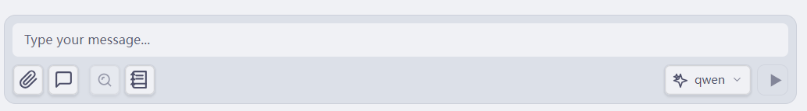
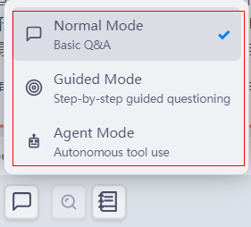
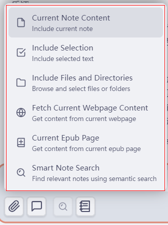
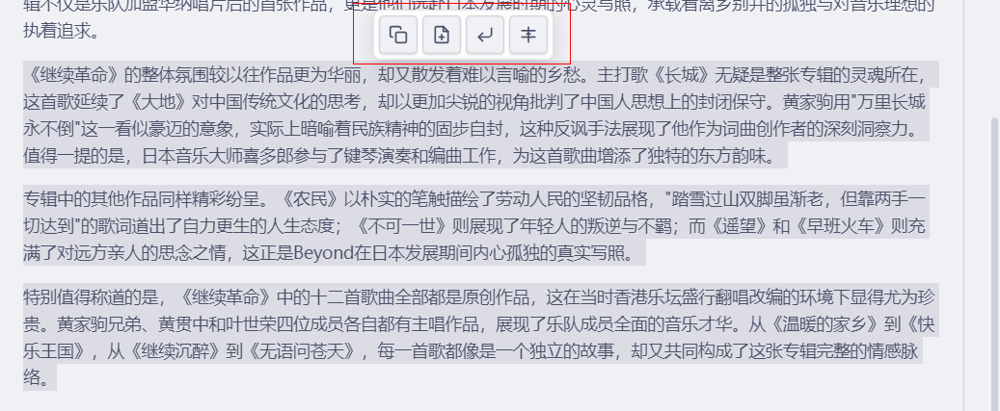

# 💬 Chat Interface Guide

## Overview

The LLMSider chat interface is your command center for AI interactions. It provides a powerful, user-friendly way to converse with AI models, manage context, and execute tools.

---

## 🎨 Interface Layout

```
┌─────────────────────────────────────────────┐
│  📝 Session Name (click to edit)           │ ← Editable session name
│  [🗑️ Clear] [➕ New] [📜 History] [⚙️]   │ ← Header actions
├─────────────────────────────────────────────┤
│                                             │
│  💬 Message Area                            │ ← Conversation
│  ─────────────────────────────────────────  │
│  👤 You: Hello!                             │
│  🤖 AI: How can I help?                     │
│                                             │
│  [📎 Context: 2 files]                      │ ← Active context
│                                             │
├─────────────────────────────────────────────┤
│  ✍️ Type your message...                   │ ← Input area
│  [📎] [Mode] [🛠️] [🔌] [🔍] [📖] [Model▼] [Send] │ ← Toolbar buttons
└─────────────────────────────────────────────┘
```

### Header Buttons


*Toolbar buttons at the top of the chat interface*

| Button | Icon | Description |
|--------|------|-------------|
| **Session Name** | 📝 | Click to edit current session name |
| **Clear Chat** | 🗑️ | Clear all messages in current session |
| **New Chat** | ➕ | Start a new conversation session |
| **History** | 📜 | View and load past conversations |
| **Settings** | ⚙️ | Open plugin settings |

---

## 🚀 Basic Usage

### Starting a Conversation

1. **Open Chat View**
   - Click LLMSider icon in left ribbon
   - Or: `Cmd+P` → "LLMSider: Open Chat"
   - Or: Ribbon menu → "Open LLMSider Chat"

2. **Type Your Message**
   - Click in the input area
   - Type your question or prompt
   - Press `Enter` or click Send button

3. **View Response**
   - AI response appears in real-time (streaming)
   - Tool executions show progress indicators
   - Results are saved automatically

### Input Toolbar Buttons

The input area features a comprehensive toolbar with multiple functions:


*Input area toolbar buttons: add context, mode selector, guided assist toggle, search, list, and model selector*

#### Left Side Buttons

| Button | Icon | Description | Availability |
|--------|------|-------------|-------------|
| **Attach Context** | 📎 | Add files, folders, or selections to context | Always |
| **Conversation Mode** | 🗣️/🤖 | Switch between Normal and Agent modes | Always |
| **Guided Assist** | 🎯 | Toggle step-by-step guidance inside Normal mode | Normal mode |
| **Built-in Tools Management** | 🛠️ | Enable/disable built-in tools by category | Normal and Agent modes |
| **MCP Servers** | 🔌 | Manage external MCP tool servers | Normal and Agent modes |
| **Context Search** | 🔍 | Toggle automatic vector database search | When Vector DB enabled |
| **Speed Reading** | 📖 | Analyze current note with AI | Always |

#### Right Side Buttons

| Button | Icon | Description |
|--------|------|-------------|
| **Model Selector** | Model▼ | Switch between configured AI models |
| **Send** | ▶️ | Send message (or press Enter) |
| **Stop** | ⏹️ | Stop generation (appears during streaming) |

### Message Formatting

LLMSider supports rich markdown formatting:

```markdown
**Bold text**
*Italic text*
`Code inline`

```code blocks```

- Lists
- Items

1. Numbered
2. Lists

> Blockquotes

[Links](https://example.com)
```

### Context & Memory

LLMSider manages conversation context automatically:

- **Working Memory**: Keeps track of your current task across messages.
- **Conversation History**: Remembers past messages (configurable limit).
- **Compaction**: Automatically summarizes long conversations to save tokens.

> **Note**: You can configure memory settings in **Settings → LLMSider → Memory Settings**.

---

## 🎯 Conversation Modes

Switch between three powerful modes:


*Conversation controls (highlighted area): Normal Mode, Guided Assist toggle, Agent Mode*

### 🗣️ Normal Mode
**Direct conversation with AI**

- Fast, immediate responses
- Best for: Quick questions, brainstorming, simple tasks
- No approval needed

**Example:**
```
You: Summarize this article: [paste URL]
AI: Here's a summary...
```

### 🎯 Guided Assist
**Step-by-step guidance inside Normal mode**

- AI breaks the task into smaller next steps
- The UI can render explicit options and confirmations
- Best for: Complex tasks, learning workflows

**Example:**
```
You: Create a weekly blog post template
AI:
    Which direction should we take first?
    ➤CHOICE:SINGLE
    ➤CHOICE: Define the blog structure
    ➤CHOICE: Draft the template content
    ➤CHOICE: Prepare frontmatter fields
```

### 🤖 Agent Mode
**Autonomous AI with tools**

- AI executes tools automatically
- Shows progress and results
- Best for: Research, data analysis, automation

**Example:**
```
You: Research top 10 AI startups and create a note for each
AI: [Tool: Web Search] Searching for AI startups...
    [Tool: Create File] Creating note "OpenAI.md"...
    [Tool: Create File] Creating note "Anthropic.md"...
    Done! Created 10 notes with key information.
```

**Switch modes:** Settings → LLMSider → Default Conversation Mode

---

## 📋 Context Management

### Adding Context

Click the 📎 icon in the input area to add context in multiple ways:


*Add context menu options: Current Note Content, Include Selection, Include Files and Directories, Fetch Current Webpage Content, Current Epub Page, Smart Note Search*

#### Method 1: File Picker
1. Click 📎 icon in input area
2. Select files from your vault
3. Files appear in context display

#### Method 2: Drag & Drop
1. Drag file from file explorer
2. Drop onto input area
3. File added to context

#### Method 3: Right-Click Selection
1. Select text in any note
2. Right-click → "Add to LLMSider Context"
3. Text added to context

#### Method 4: Folder Context
1. Click 📎 icon
2. Choose "Add Folder"
3. Select folder (includes all files)

### Managing Context

**View Active Context:**
```
📎 Context (3 items):
  📄 project-plan.md
  📄 research-notes.md
  📁 Meeting Notes/ (5 files)
```

**Remove Context:**
- Click ✕ next to any item
- Or: Click "Clear All"

**Context Types:**

| Type | Icon | Description |
|------|------|-------------|
| File | 📄 | Single note |
| Selection | ✂️ | Text excerpt |
| Folder | 📁 | All files in folder |
| Web | 🌐 | Fetched web content |

### Context Best Practices

1. **Be Selective**
   - Only include relevant files
   - Too much context = slower responses
   - Recommended: 3-5 files maximum

2. **Update Regularly**
   - Remove outdated context
   - Add new relevant files
   - Keep context fresh

3. **Use Folders Wisely**
   - Great for related notes
   - Watch total file count
   - Can include hundreds of files

---

## 🔧 Advanced Features

### Provider Tabs

Quick-switch between models:

```
[GPT-4 ●] [Claude] [Gemini] [Ollama]
```

- ● = Currently active
- Click tab to switch
- Conversation continues with new model

### Session Management

**Create New Session:**
- Click 🔄 New Session
- Or: `Cmd+N` in chat view

**View History:**
- Click 📁 History
- Browse past conversations
- Click to load session

**Auto-Naming:**
- First message becomes session name
- Or: Right-click session → Rename

**Delete Sessions:**
- Right-click session → Delete
- Confirm deletion

### Message Actions

Hover over any message to reveal quick action buttons:


*Quick action buttons on AI messages (highlighted area): copy as Markdown, generate new note, insert at cursor, regenerate*

#### User Message Actions
| Action | Icon | Description |
|--------|------|-------------|
| **Copy** | 📋 | Copy message to clipboard |
| **Edit Message** | ✏️ | Edit this message (removes this and all subsequent messages, puts content back in input box) |

#### Assistant Message Actions
| Action | Icon | Description |
|--------|------|-------------|
| **Copy as Markdown** | 📋 | Copy response in markdown format |
| **Generate New Note** | 📄 | Create a new note from this response |
| **Insert at Cursor** | ↙️ | Insert response at current cursor position in active editor |
| **Regenerate** | 🔄 | Delete this response and regenerate with previous user message |
| **Apply Changes** | ✅ | Apply diff to file (when diff is present) |
| **Toggle Diff** | 👁️ | Switch between rendered and diff view (when diff is present) |

**New in this version:**
- **Insert at Cursor**: Smart editor detection with automatic focus
- **Edit Message**: Clean way to revise your questions
- **Regenerate**: Quick response regeneration without manual resending

#### 💡 Special Features in Selected Text Mode

When you use the "Include selected text" feature and ask AI to modify, polish, or rewrite the selected text, two special buttons appear:

**👁️ Toggle Diff View**
- Visually compare original text with AI-generated content
- Red shows deleted content, green shows added content
- Helps you quickly understand exactly what changes AI made
- Click to toggle between diff view and rendered view

**✅ Apply Changes**
- One-click to apply AI's modifications to the original note
- Automatically locates and replaces the selected text portion
- Preserves the rest of the note unchanged
- Supports undo operation (Ctrl/Cmd + Z)

**Workflow Example**:
```
1. Select a paragraph that needs improvement in your note
2. Click 📎 → "Include Selection"
3. Enter prompt: "Please rewrite this paragraph more concisely"
4. After AI responds, click 👁️ to view diff comparison
5. Confirm changes are reasonable, then click ✅ to apply
6. The selected portion in the original note is automatically replaced
```

**Important Tips**:
- These buttons only appear when using "selected text" as context
- If multiple files or entire note are included, buttons will be hidden
- Recommended to review diff before applying to avoid unintended overwrites
- You can disable diff rendering in Settings → Action Mode

### Diff Rendering

When AI suggests file changes:

```diff
- Old content
+ New content
```

**Actions:**
- ✅ **Apply**: Write changes to file
- ❌ **Reject**: Discard changes
- 👁️ **Preview**: View full diff

---

## 🛠️ Tool Integration

### Built-in Tools

100+ tools available across categories:

#### Core Tools
- `create_file` - Create new notes
- `edit_file` - Modify existing notes
- `read_file` - Read note contents
- `search_vault` - Search your vault

#### Web Tools
- `fetch_web_content` - Download web pages
- `google_search` - Search Google
- `duckduckgo_search` - DuckDuckGo search

#### Financial Tools
- `get_stock_quote` - Stock prices
- `get_crypto_price` - Crypto data
- `get_forex_rate` - Currency exchange

[See full tool list →](built-in-tools.md)

### Tool Usage in Chat

**Automatic (Agent Mode):**
```
You: What's the current price of Bitcoin?
AI: [Tool: get_crypto_price] Fetching Bitcoin price...
    Bitcoin (BTC): $43,250.00 USD
```

**Manual (Normal Mode):**
```
You: Use tool "get_stock_quote" with symbol "AAPL"
AI: [Tool: get_stock_quote]
    Apple Inc (AAPL): $185.34 USD
```

### Tool Permissions

Control which tools AI can use:

1. Settings → LLMSider → Built-in Tools
2. Toggle categories or individual tools
3. Changes apply immediately

---

## ⚙️ Chat Settings

### Display Options

**Diff Rendering:**
- Enable: Show visual diffs
- Disable: Show text changes only

**Message Timestamps:**
- Show time sent
- Relative (2 hours ago) or Absolute (14:30)

**Syntax Highlighting:**
- Enable for code blocks
- Supports 100+ languages

### Behavior Settings

**Auto-Scroll:**
- Scroll to new messages automatically
- Disable for manual control

**Typing Indicators:**
- Show when AI is typing
- Disable for cleaner interface

**Sound Notifications:**
- Notification sound on message received
- Customize sound in Obsidian settings

### Model Settings

Configure per-model:
- Temperature
- Max tokens
- Top P
- Frequency/Presence penalties

---

## 💡 Usage Tips

### 🎯 Effective Prompts

**Be Specific:**
```
❌ "Help me write"
✅ "Write a blog post about productivity apps (500 words, casual tone)"
```

**Provide Context:**
```
❌ "Fix this code"
✅ "This TypeScript function should validate emails. It's returning false for valid emails. Here's the code: [paste code]"
```

**Break Down Complex Tasks:**
```
❌ "Build a complete website"
✅ "Step 1: Create HTML structure for homepage
     Step 2: Add CSS styling
     Step 3: Implement contact form"
```

### 🚀 Workflow Strategies

**Research Workflow:**
1. Use Google Search tool for sources
2. Fetch web content for each source
3. Ask AI to synthesize findings
4. Create notes with references

**Writing Workflow:**
1. Brainstorm with AI (Normal Mode)
2. Outline structure (Guided Assist)
3. Generate draft sections (Agent Mode)
4. Refine with targeted edits

**Code Review Workflow:**
1. Add code files to context
2. Ask for review and suggestions
3. Apply diffs to files
4. Test and iterate

---

## 🐛 Troubleshooting

### Common Issues

**Chat not responding:**
- Check internet connection
- Verify API key is valid
- Try switching models
- Check Obsidian console for errors

**Slow responses:**
- Reduce context files
- Lower max tokens
- Use faster model (GPT-3.5 vs GPT-4)
- Check provider status

**Tool execution failing:**
- Enable required tools in settings
- Check tool permissions
- Verify file/folder access
- Review debug logs

**Context not working:**
- Ensure files exist in vault
- Check file permissions
- Clear and re-add context
- Restart Obsidian

### Debug Mode

Enable for detailed logging:

1. Settings → LLMSider → Advanced
2. Enable Debug Logging
3. Open Developer Console (`Cmd+Option+I`)
4. Reproduce issue
5. Check console for errors

---

## 📚 Keyboard Shortcuts

| Action | Shortcut | Description |
|--------|----------|-------------|
| Open Chat | - | Click ribbon icon |
| Send Message | `Enter` | Send current message |
| New Line | `Shift+Enter` | Add line break |
| New Session | `Cmd+N` | Create new chat |
| Clear Context | - | Click "Clear All" |
| Copy Message | `Cmd+C` | Hover + click copy |
| Search History | `Cmd+F` | In history sidebar |

---

## 📖 Related Guides

- [Conversation Modes](conversation-modes.md) - Deep dive into modes
- [Context Management](context-management.md) - Advanced context usage
- [Built-in Tools](built-in-tools.md) - Complete tool reference
- [Troubleshooting](troubleshooting.md) - Fix common issues

---

**Questions?** [Open an issue](https://github.com/gnuhpc/obsidian-llmsider/issues)
