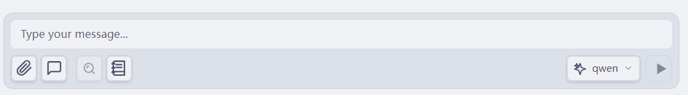
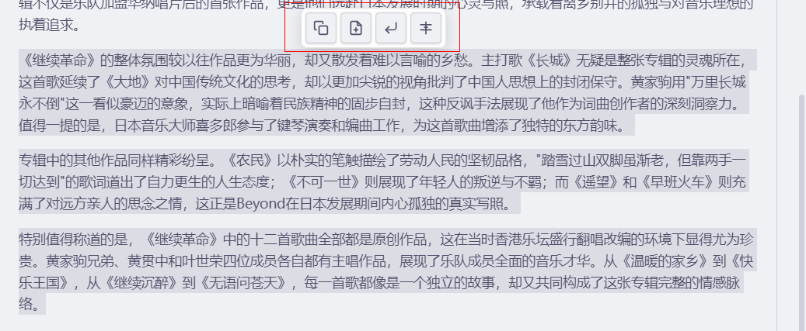
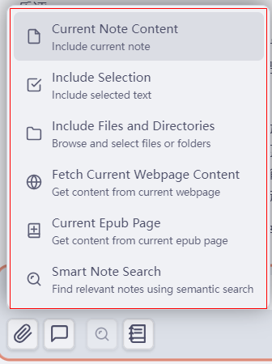

# 💬 聊天界面指南

## 概述

LLMSider 聊天界面是您与 AI 交互的指挥中心。它提供了一个强大且用户友好的方式来与 AI 模型对话、管理上下文和执行工具。

---

## 🎨 界面布局

```
┌─────────────────────────────────────────────┐
│  📝 会话名称 (点击编辑)                    │ ← 可编辑的会话名称
│  [🗑️ 清空] [➕ 新建] [📜 历史] [⚙️]      │ ← 头部操作
├─────────────────────────────────────────────┤
│                                             │
│  💬 消息区域                                │ ← 对话
│  ─────────────────────────────────────────  │
│  👤 您: 你好!                              │
│  🤖 AI: 有什么可以帮您的?                  │
│                                             │
│  [📎 上下文: 2 个文件]                     │ ← 活动上下文
│                                             │
├─────────────────────────────────────────────┤
│  ✍️ 输入您的消息...                        │ ← 输入区域
│  [📎] [模式] [🛠️] [🔌] [🔍] [📖] [模型▼] [发送] │ ← 工具栏按钮
└─────────────────────────────────────────────┘
```

### 头部按钮


*聊天界面顶部的工具栏按钮*

| 按钮 | 图标 | 描述 |
|--------|------|-------------|
| **会话名称** | 📝 | 点击编辑当前会话名称 |
| **清空聊天** | 🗑️ | 清除当前会话中的所有消息 |
| **新建聊天** | ➕ | 开始新的对话会话 |
| **历史记录** | 📜 | 查看和加载过去的对话 |
| **设置** | ⚙️ | 打开插件设置 |

---

## 🚀 基本用法

### 开始对话

1. **打开聊天视图**
   - 点击左侧边栏的 LLMSider 图标
   - 或: `Cmd+P` → "LLMSider: 打开聊天"
   - 或: 功能区菜单 → "打开 LLMSider 聊天"

2. **输入您的消息**
   - 点击输入区域
   - 输入您的问题或提示
   - 按 `Enter` 或点击发送按钮

3. **查看响应**
   - AI 响应实时显示(流式传输)
   - 工具执行显示进度指示器
   - 结果自动保存

### 输入工具栏按钮

输入区域配有完整的工具栏，提供多种功能：


*输入区域的工具栏按钮：添加上下文、对话模式、搜索、列表和模型选择*

#### 左侧按钮

| 按钮 | 图标 | 描述 | 可用性 |
|--------|------|-------------|-------------|
| **添加上下文** | 📎 | 将文件、文件夹或选择添加到上下文 | 始终 |
| **对话模式** | 🗣️/🎯/🤖 | 在普通/引导/代理模式之间切换 | 始终 |
| **内置工具管理** | 🛠️ | 按类别启用/禁用内置工具 | 仅引导/代理模式 |
| **MCP 服务器** | 🔌 | 管理外部 MCP 工具服务器 | 仅引导/代理模式 |
| **上下文搜索** | 🔍 | 切换自动向量数据库搜索 | 启用向量数据库时 |
| **速读** | 📖 | 用 AI 分析当前笔记 | 始终 |

#### 右侧按钮

| 按钮 | 图标 | 描述 |
|--------|------|-------------|
| **模型选择器** | 模型▼ | 在配置的 AI 模型之间切换 |
| **发送** | ▶️ | 发送消息（或按 Enter） |
| **停止** | ⏹️ | 停止生成（流式传输期间出现） |

### 消息格式化

LLMSider 支持丰富的 Markdown 格式:

```markdown
**粗体文本**
*斜体文本*
`行内代码`

```代码块```

- 列表
- 项目

1. 编号
2. 列表

> 引用

[链接](https://example.com)
```

### 上下文与记忆

LLMSider 自动管理对话上下文:

- **工作记忆**: 跨消息跟踪您当前的任务。
- **对话历史**: 记住过去的消息(可配置限制)。
- **压缩**: 自动总结长对话以节省令牌。

> **注意**: 您可以在 **设置 → LLMSider → 记忆设置** 中配置记忆设置。

---

## 🎯 对话模式

在三种强大的模式之间切换:


*对话模式选择菜单（高亮区域）：普通模式（当前选中）、引导模式、代理模式*

### 🗣️ 普通模式
**与 AI 直接对话**

- 快速、即时的响应
- 最适合: 快速提问、头脑风暴、简单任务
- 无需批准

### 🎯 引导模式
**逐步任务分解**

- AI 创建带有步骤的计划
- 您在执行前批准每个步骤
- 最适合: 复杂任务、学习工作流程

### 🤖 代理模式
**具有工具访问权限的自主 AI**

- AI 自动执行工具
- 显示进度和结果
- 最适合: 研究、数据分析、自动化

**切换模式:** 设置 → LLMSider → 默认对话模式

---

## 💫 消息操作

将鼠标悬停在任何消息上即可显示快捷操作按钮：


*AI 消息上的快捷操作按钮（高亮部分）：复制为 Markdown、生成新笔记、插入到光标处、重新生成*

### 用户消息操作
| 操作 | 图标 | 说明 |
|------|------|------|
| **复制消息** | 📋 | 复制消息到剪贴板 |
| **编辑消息** | ✏️ | 编辑此消息（删除此消息及之后的所有消息，将内容放回输入框） |

### 助手消息操作
| 操作 | 图标 | 说明 |
|------|------|------|
| **复制为 Markdown** | 📋 | 以 Markdown 格式复制响应 |
| **生成新笔记** | 📄 | 从此响应创建新笔记 |
| **插入到光标处** | ↙️ | 在活动编辑器的当前光标位置插入响应 |
| **重新生成** | 🔄 | 删除此响应并使用上一条用户消息重新生成 |
| **应用更改** | ✅ | 将差异应用到文件（当存在差异时） |
| **切换差异视图** | 👁️ | 在渲染视图和差异视图之间切换（当存在差异时） |

**本版本新增功能:**
- **插入到光标处**: 智能编辑器检测，自动聚焦
- **编辑消息**: 便捷的方式修改您的问题
- **重新生成**: 快速重新生成响应，无需手动重发

**使用提示:**
- 编辑用户消息会撤回该消息及后续所有对话
- 重新生成会自动找到上一条用户消息并重新发送
- 插入光标功能会智能查找活动的 Markdown 编辑器

#### 💡 选中文本模式下的特殊功能

当您使用"引入选中文本"功能，并让 AI 对选中的文本进行修改、润色或重写时，会出现两个特殊按钮：

**👁️ 切换差异视图**
- 以可视化方式对比原文和 AI 生成的内容
- 红色显示删除的内容，绿色显示新增的内容
- 帮助您快速了解 AI 做了哪些具体改动
- 点击可在差异视图和普通渲染视图之间切换

**✅ 应用更改**
- 一键将 AI 的修改应用到原笔记
- 自动定位并替换选中的文本部分
- 保留笔记的其他内容不变
- 支持撤销操作（Ctrl/Cmd + Z）

**工作流程示例**：
```
1. 在笔记中选择一段需要改进的文字
2. 点击 📎 → "包含选中内容"
3. 输入提示词："请将这段话改写得更简洁专业"
4. AI 生成回复后，点击 👁️ 查看差异对比
5. 确认修改合理后，点击 ✅ 应用更改
6. 原笔记中的选中部分被自动替换
```

**重要提示**：
- 这两个按钮仅在使用"选中文本"作为上下文时出现
- 如果同时引入了多个文件或整个笔记，按钮会被隐藏
- 应用更改前建议先查看差异，避免意外覆盖
- 可在设置中关闭差异渲染功能（Settings → Action Mode）

---

## 📋 上下文管理

### 添加上下文

点击输入区域的 📎 图标，可以通过多种方式添加上下文：


*添加上下文菜单选项：当前笔记内容、包含选中内容、包含文件和目录、获取当前网页内容、当前 Epub 页面、智能笔记搜索*

#### 方法 1: 文件选择器
1. 点击输入区域的 📎 图标
2. 从笔记库中选择文件
3. 文件出现在上下文显示中

#### 方法 2: 拖放
1. 从文件浏览器拖动文件
2. 放到输入区域
3. 文件添加到上下文

#### 方法 3: 右键选择
1. 在任何笔记中选择文本
2. 右键 → "添加到 LLMSider 上下文"
3. 文本添加到上下文

#### 方法 4: 文件夹上下文
1. 点击 📎 图标
2. 选择"添加文件夹"
3. 选择文件夹(包含所有文件)

---

## 🔧 高级功能

### 提供商标签

在模型之间快速切换:

```
[GPT-4 ●] [Claude] [Gemini] [Ollama]
```

- ● = 当前活动
- 点击标签切换
- 对话继续使用新模型

### 会话管理

**创建新会话:**
- 点击 🔄 新建会话
- 或: 聊天视图中的 `Cmd+N`

**查看历史:**
- 点击 📁 历史
- 浏览过去的对话
- 点击加载会话

---

## 🛠️ 工具集成

### 内置工具

100+ 个工具可用,涵盖多个类别:

#### 核心工具
- `create_file` - 创建新笔记
- `edit_file` - 修改现有笔记
- `read_file` - 读取笔记内容
- `search_vault` - 搜索笔记库

#### 网页工具
- `fetch_web_content` - 下载网页
- `google_search` - Google 搜索
- `duckduckgo_search` - DuckDuckGo 搜索

#### 金融工具
- `get_stock_quote` - 股票价格
- `get_crypto_price` - 加密货币数据
- `get_forex_rate` - 货币兑换

[查看完整工具列表 →](built-in-tools.md)

---

## ⚙️ 聊天设置

### 显示选项

**差异渲染:**
- 启用: 显示可视化差异
- 禁用: 仅显示文本更改

**消息时间戳:**
- 显示发送时间
- 相对(2 小时前)或绝对(14:30)

**语法高亮:**
- 为代码块启用
- 支持 100+ 种语言

---

## 💡 使用技巧

### 🎯 有效的提示

**要具体:**
```
❌ "帮我写作"
✅ "写一篇关于生产力应用的博客文章(500字,随意语气)"
```

**提供上下文:**
```
❌ "修复这段代码"
✅ "这个 TypeScript 函数应该验证电子邮件。它对有效电子邮件返回 false。代码如下: [粘贴代码]"
```

---

## 🐛 故障排除

### 常见问题

**聊天无响应:**
- 检查网络连接
- 验证 API 密钥有效
- 尝试切换模型
- 检查 Obsidian 控制台错误

**响应慢:**
- 减少上下文文件
- 降低最大令牌数
- 使用更快的模型(GPT-3.5 vs GPT-4)
- 检查提供商状态

---

## 📚 键盘快捷键

| 操作 | 快捷键 | 描述 |
|--------|----------|-------------|
| 打开聊天 | - | 点击功能区图标 |
| 发送消息 | `Enter` | 发送当前消息 |
| 新行 | `Shift+Enter` | 添加换行符 |
| 新会话 | `Cmd+N` | 创建新聊天 |
| 清除上下文 | - | 点击"全部清除" |

---

## 📖 相关指南

- [对话模式](conversation-modes.md) - 模式深入了解
- [内置工具](built-in-tools.md) - 完整工具参考
- [设置指南](settings-guide.md) - 配置

---

**有疑问?** [打开问题](https://github.com/gnuhpc/obsidian-llmsider/issues)
