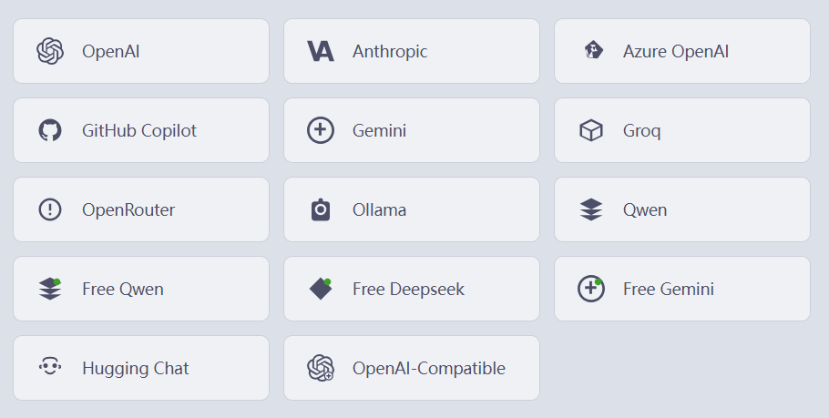
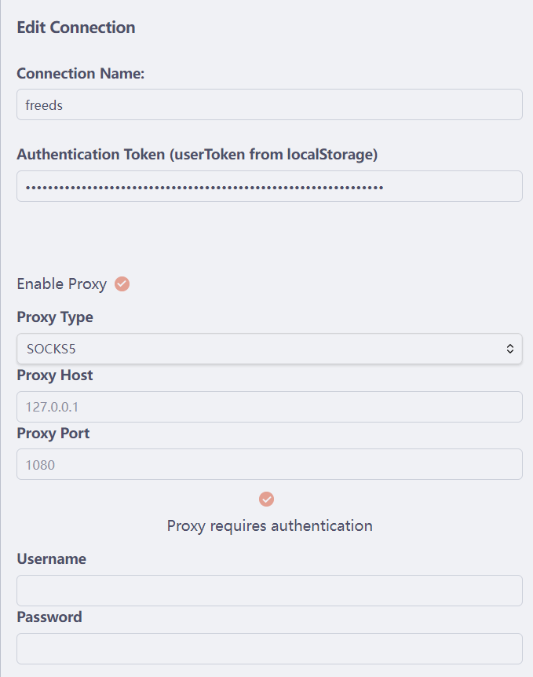
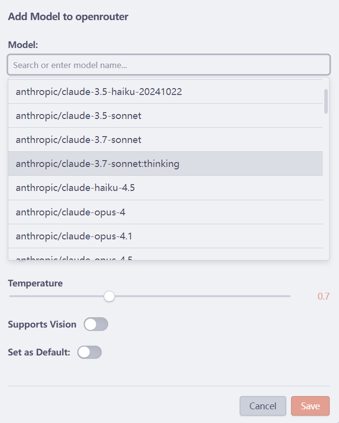

# 🔗 连接与模型指南

## 概述

LLMSider 使用灵活的 **连接 + 模型** 架构,允许您:
- 同时连接到多个 AI 提供商
- 为每个提供商配置多个模型
- 即时切换模型
- 独立管理 API 密钥和设置

---

## 🎯 关键概念

### 连接
**连接** 表示与 AI 提供商 API 的链接。它存储:
- 提供商类型(OpenAI、Anthropic 等)
- API 凭据(密钥、端点)
- 基础 URL 和配置
- 连接特定的设置

### 模型
**模型** 是连接中的特定 AI 模型配置:
- 模型名称(例如 gpt-4、claude-3-5-sonnet)
- 参数(温度、最大令牌数)
- 模型特定设置
- 嵌入模型 vs 聊天模型指定

---

## 🚀 设置连接

### 步骤 1: 打开设置
1. 点击 Obsidian 的齿轮图标
2. 导航到 **LLMSider** 部分
3. 在顶部找到 **连接和模型** 部分

### 步骤 2: 添加连接

点击任意提供商卡片开始配置:


*LLMSider 中可用的 AI 提供商连接*

#### 支持的提供商

1. **OpenAI**
   ```
   API 密钥: sk-...
   基础 URL: https://api.openai.com/v1 (默认)
   ```

2. **Anthropic (Claude)**
   ```
   API 密钥: sk-ant-...
   基础 URL: https://api.anthropic.com (默认)
   ```

3. **GitHub Copilot**
   ```
   GitHub 令牌: ghp_...
   (Copilot 令牌自动刷新)
   ```

4. **Azure OpenAI**
   ```
   API 密钥: 您的 Azure API 密钥
   端点: https://<resource>.openai.azure.com
   部署名称: 您的部署名称
   API 版本: 2024-02-15-preview
   ```

5. **Gemini**
   ```
   API 密钥: AIza...
   基础 URL: https://generativelanguage.googleapis.com/v1
   ```

6. **Groq**
   ```
   API 密钥: gsk_...
   基础 URL: https://api.groq.com/openai/v1
   ```

7. **Ollama (本地)**
   ```
   基础 URL: http://localhost:11434
   (无需 API 密钥)
   ```

8. **Qwen (通义千问)**
   ```
   API 密钥: sk-...
   基础 URL: https://dashscope.aliyuncs.com/compatible-mode/v1
   ```

9. **Hugging Face (嵌入)**
   ```
   API 密钥: hf_...
   模型: sentence-transformers/all-MiniLM-L6-v2
   ```

10. **OpenAI 兼容**
    ```
    基础 URL: 您的自定义端点
    ```

11. **xAI (Grok)**
    ```
    API 密钥: xai-...
    基础 URL: https://api.x.ai/v1
    ```

12. **OpenRouter**
    ```
    API 密钥: sk-or-...
    基础 URL: https://openrouter.ai/api/v1
    ```

13. **Free Qwen (免费通义千问)**
    ```
    (无需 API 密钥,内置免费访问)
    ```

14. **Free DeepSeek (免费深度求索)**
    ```
    (无需 API 密钥,内置免费访问)
    ```

15. **Free Gemini (免费 Gemini)**
    ```
    (无需 API 密钥,内置免费访问)
    ```

16. **Hugging Chat**
    ```
    (无需 API 密钥,支持多种开源模型)
    ```

17. **Local (本地模型)**
    ```
    基础 URL: http://localhost:1234/v1
    (支持 LM Studio, LocalAI 等)
    ```

18. **OpenCode**
    ```
    服务器地址: http://localhost:4097
    (无需 API 密钥,本地 HTTP 服务器)
    ```

### 步骤 3: 配置连接设置

填写连接表单:


*连接配置,包含代理设置和身份验证*

| 字段 | 描述 | 必需 |
|-------|-------------|----------|
| **名称** | 此连接的友好名称 | ✅ |
| **类型** | 提供商类型(从卡片自动填充) | ✅ |
| **API 密钥** | 您的提供商 API 密钥 | ✅* |
| **基础 URL** | API 端点(有智能默认值) | ⚠️ |
| **已启用** | 切换以启用/禁用连接 | ✅ |

*Ollama 或自定义本地设置不需要

---

## 🎨 管理模型

### 添加模型

1. **点击"添加模型"** - 在任何连接下
2. **填写模型详细信息**:

   
   *模型配置对话框,包含温度和视觉支持设置*

   | 字段 | 描述 | 示例 |
   |-------|-------------|---------|
   | **名称** | 显示名称 | GPT-4 Turbo |
   | **模型名称** | API 模型标识符 | gpt-4-1106-preview |
   | **类型** | 聊天或嵌入 | 聊天 |
   | **温度** | 创造力(0-2) | 0.7 |
   | **最大令牌数** | 响应长度限制 | 4096 |

3. **设为默认**(可选): 标记为此连接的首选模型

### 模型参数

#### 温度
控制响应的随机性:
- `0.0` - 确定性、一致
- `0.5-0.8` - 平衡(推荐)
- `1.0+` - 创造性、多样化

#### 最大令牌数
最大响应长度:
- **聊天模型**: 通常 1000-4096 令牌
- **嵌入模型**: 改为设置嵌入维度

---

## 🎯 使用多个模型

### 快速切换

**在聊天界面中:**
1. 查看顶部的提供商标签
2. 点击任何标签切换活动模型
3. 当前对话无缝继续

**通过设置:**
1. 启用/禁用连接和模型
2. 更改立即应用

### 模型选择策略

| 用例 | 推荐模型 | 原因 |
|----------|-------------------|-----|
| **中文对话** | Qwen Max, DeepSeek V3.2 | 中文理解和生成能力卓越 |
| **英文对话** | Claude 3.5 Sonnet, Claude 3 Opus | 英文表达和推理能力顶尖 |
| **代码生成** | Claude 3.5 Sonnet, GPT-4o | 代码理解和生成能力强 |
| **长文本分析** | Claude 3.5 Sonnet (200K tokens), Gemini 1.5 Pro (2M tokens) | 超长上下文窗口 |
| **多模态视觉** | GPT-4o, Gemini 1.5 Pro, Qwen VL Max | 图文理解能力 |
| **文生图** | DALL-E 3 (OpenAI), Qwen VL Plus/Max, Gemini 3 Pro Image | 根据文字描述生成图片 |
| **快速响应** | GPT-4o mini, DeepSeek Chat | 快速、经济 |
| **本地隐私** | Ollama (Qwen2.5, Llama 3.3) | 完全离线，无 API 调用 |
| **嵌入向量** | text-embedding-3-large, bge-large-zh-v1.5 | 语义搜索质量 |

### 多模态支持 (图文混合)

部分连接类型支持**图像识别和文件解析**功能,可在对话中上传图片、PDF 或其他文件进行分析:

| 连接类型 | 多模态支持 | 说明 |
|---------|------------|------|
| **OpenAI** | ✅ 部分模型 | GPT-4o、GPT-4 Turbo、GPT-4 Vision 等模型支持 |
| **Qwen (通义千问)** | ✅ 部分模型 | 包含 "vision" 或 "vl" 关键词的模型支持 |
| **Free Qwen (免费通义千问)** | ✅ 全部模型 | 所有模型均支持图文混合输入 |
| **Free DeepSeek (免费深度求索)** | ✅ 全部模型 | 所有模型均支持图片上传 |
| **GitHub Copilot** | ✅ 部分模型 | GPT-4 系列模型支持 |
| **Hugging Chat** | ✅ 部分模型 | 仅 Llama 3.2 11B Vision 等包含 "vision" 的模型支持 |
| **OpenAI 兼容** | ✅ 可配置 | 支持手动配置或自动检测(LLaVA、MiniCPM-V、CogVLM、Gemini Vision 等) |
| **Anthropic (Claude)** | ❌ 待支持 | 当前版本暂不支持 |
| **其他提供商** | ❌ 不支持 | Azure OpenAI、Gemini、Groq、Ollama 等暂不支持 |

> 💡 **提示**: 在聊天界面中,支持多模态的模型会显示附件上传按钮(📎),您可以直接拖拽图片或 PDF 文件到对话中。

### 文生图支持

部分连接类型支持**文生图(Text-to-Image)**功能,可以根据文字描述自动生成图片:

| 连接类型 | 文生图支持 | 说明 |
|---------|------------|------|
| **OpenAI** | ✅ DALL-E 模型 | dall-e-3、dall-e-2 模型支持文生图 |
| **Qwen (通义千问)** | ✅ 部分模型 | qwen-vl-plus、qwen-vl-max 等 VL 系列模型支持 |
| **Gemini** | ✅ Image 模型 | Gemini 3 Pro Image (nano banana) 支持文生图 |
| **OpenAI 兼容** | ✅ 可配置 | 兼容 OpenAI 图像生成 API 的服务 |
| **其他提供商** | ❌ 不支持 | 当前版本其他提供商暂不支持文生图 |

**使用方法:**
1. 选择支持文生图的模型(如 DALL-E 3、Qwen VL Plus 或 Gemini 3 Pro Image)
2. 在对话中描述您想要生成的图片
3. AI 会自动调用图像生成功能并返回图片
4. 生成的图片会显示在聊天消息中,可以下载保存

**示例提示词:**
```
"画一只在月光下的橘猫,水彩画风格"
"生成一个现代简约风格的 logo,主题是科技创新"
"Create a sunset over mountains in oil painting style"
```

> 💡 **提示**: DALL-E 3 生成高质量图片,Qwen VL 系列支持中文提示词且响应速度快,Gemini 3 Pro Image (nano banana) 提供创新的图像生成能力。

---

## 🔧 高级配置

### 代理设置

LLMSider 支持为每个连接单独配置代理服务器。这在以下情况下非常有用：
- 您处于企业防火墙之后
- 需要通过特定代理路由流量
- 使用的服务在您的地区被封锁
- 希望增强隐私和安全性

#### 启用代理

1. **打开连接设置**
   - 导航到 设置 → LLMSider → 连接与模型
   - 点击您连接旁边的编辑图标（✏️）

2. **配置代理设置**：

   | 字段 | 描述 | 示例 |
   |-------|-------------|----------|
   | **启用代理** | 切换以为此连接启用代理 | ✅ |
   | **代理类型** | 选择代理协议 | SOCKS5 / HTTP / HTTPS |
   | **代理主机** | 代理服务器地址 | 127.0.0.1 或 proxy.example.com |
   | **代理端口** | 代理服务器端口 | 1080 (SOCKS5) / 8080 (HTTP) |
   | **身份验证** | 如果代理需要登录则启用 | ✅/❌ |
   | **用户名** | 代理用户名（如启用身份验证） | user123 |
   | **密码** | 代理密码（如启用身份验证） | ******** |

3. **保存并测试**
   - 点击“保存”应用设置
   - 发送测试消息验证连接性

#### 代理类型

**SOCKS5**（推荐）
- 最通用且安全
- 适用于所有提供商
- 性能优于 HTTP 代理
- 常用端口：1080

**HTTP/HTTPS**
- 标准 Web 代理
- 广泛兼容
- 流式传输可能有限制
- 常用端口：8080、3128

#### 常见代理配置

**本地 Shadowsocks/V2Ray：**
```
代理类型: SOCKS5
代理主机: 127.0.0.1
代理端口: 1080
身份验证: 禁用
```

**企业代理含身份验证：**
```
代理类型: HTTP
代理主机: proxy.company.com
代理端口: 8080
身份验证: 启用
用户名: your_username
密码: your_password
```

**Clash/ClashX：**
```
代理类型: HTTP 或 SOCKS5
代理主机: 127.0.0.1
代理端口: 7890 (HTTP) 或 7891 (SOCKS5)
身份验证: 禁用
```

#### 每个连接单独配置代理

- 每个连接可以有自己的代理设置
- 示例用例：
  - 为 OpenAI 使用代理（地区封锁）
  - Ollama 直连（本地服务）
  - 不同提供商使用不同代理

#### 代理问题排查

**连接超时：**
- 验证代理主机和端口是否正确
- 检查代理服务器是否运行
- 用其他应用测试代理

**身份验证失败：**
- 仔细检查用户名和密码
- 确保代理允许身份验证
- 先尝试不启用身份验证

**性能缓慢：**
- 尝试使用 SOCKS5 而不是 HTTP
- 检查代理服务器负载
- 考虑使用更快的代理

**某些提供商可用，其他不可用：**
- 某些提供商可能封锁代理 IP
- 尝试不同的代理服务器
- 检查提供商的服务条款

> 💡 **提示**：您可以仅为特定连接启用代理。例如，为 OpenAI 使用代理，同时保持 Ollama 直连。

### 连接级功能

#### 自动重连
自动重新连接断开的连接

#### 速率限制
内置速率限制以遵守 API 配额

#### 令牌刷新 (GitHub Copilot)
到期前自动令牌更新

---

## 💡 提示和最佳实践

### 🎯 连接管理

1. **使用描述性名称**
   ```
   ✅ "OpenAI GPT-4 个人"
   ❌ "连接 1"
   ```

2. **按用途组织**
   - `工作 - Azure OpenAI`
   - `个人 - OpenAI`
   - `本地 - Ollama`

3. **设置合理限制**
   - 不要超过提供商的速率限制
   - 为探索性聊天使用较低的最大令牌数
   - 为最终草稿保留高令牌数

### 🔒 安全最佳实践

1. **API 密钥**
   - 永远不要共享您的 API 密钥
   - 定期轮换密钥
   - 如果可能,使用环境变量存储密钥

2. **访问控制**
   - 不需要时禁用连接
   - 为不同项目使用单独的密钥
   - 定期监控 API 使用情况

3. **本地替代方案**
   - 考虑使用 Ollama 处理敏感数据
   - 使用 OpenAI 兼容的本地服务器
   - 自托管嵌入模型

---

## 🐛 故障排除

### 连接问题

**问题**: 连接失败
- ✅ 验证 API 密钥正确
- ✅ 检查基础 URL 格式
- ✅ 确保网络连接
- ✅ 检查提供商状态页面

**问题**: 响应慢
- ✅ 检查网络延迟
- ✅ 尝试不同的模型
- ✅ 减少最大令牌数
- ✅ 禁用不必要的工具

---

## 📚 延伸阅读

- [聊天界面指南](chat-interface.md)
- [自动补全设置](autocomplete.md)
- [MCP 集成](mcp-integration.md)
- [故障排除指南](troubleshooting.md)

---

**需要帮助?** [打开问题](https://github.com/gnuhpc/obsidian-llmsider/issues)
